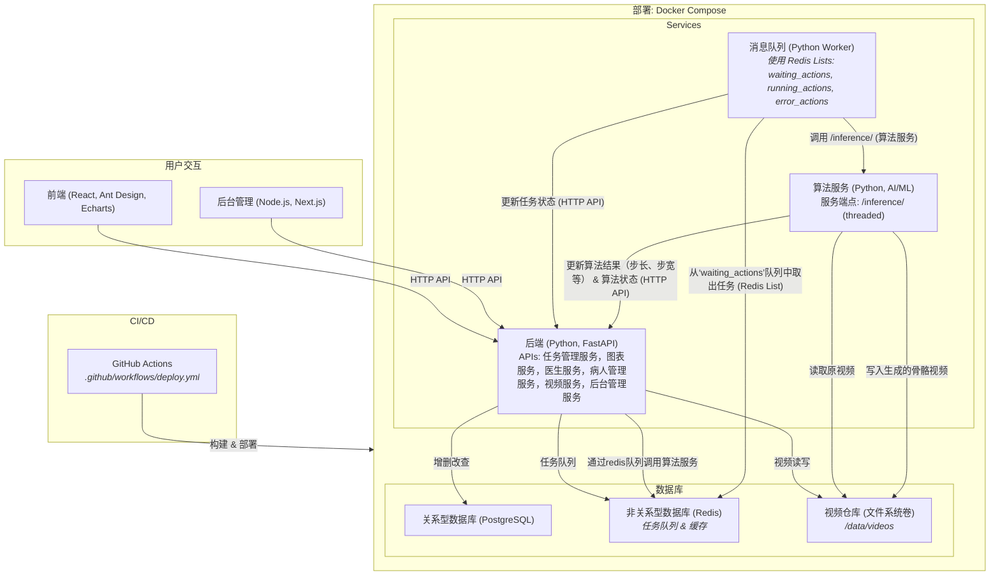

# StrikeAPose

StrikeAPose 是一个基于视频的动作检测系统，用户可以上传视频并创建动作，系统会检测视频中的动作并生成包含检测结果的新视频。


### 主要模块

#### backend
- **描述**: 基于 FastAPI 的后端服务。
- **功能**: 提供 API 接口，用于管理用户、医生、视频、动作等数据。

#### core
- **描述**: 核心算法模块。
- **功能**: 使用 YOLO 模型进行动作检测，模型基于 COCO 数据集训练，并在自定义数据集上进行微调。

#### queue_service
- **描述**: 队列服务模块。
- **功能**: 处理用户触发的动作请求，将动作发送到核心模块进行处理，支持多请求并发。

#### ui
- **描述**: 前端用户界面。
- **功能**: 提供视频播放和数据可视化功能。

#### deploy
- **描述**: 部署脚本。
- **功能**: 安装核心模块所需的依赖包。

## 功能特性

1. **视频上传与动作检测**: 用户上传视频并创建动作，系统会检测视频中的动作并生成新视频。
2. **数据可视化**: 提供步速、步幅、步长差异等数据的可视化图表。
3. **分布式处理**: 使用队列服务处理用户请求，确保高效和稳定的任务执行。

## 如何运行

1. 克隆项目代码：
   ```bash
   git clone <repository-url>
   cd StrikeAPose
   ```

2. 安装核心模块依赖：
   ```bash
   ./deploy/install.sh
   ```

3. 启动所有服务：
   ```bash
   docker-compose up
   ```

4. 打开浏览器访问 `http://localhost:8000/docs` 查看 API 文档。

5. 上传视频并创建动作，系统将检测视频中的动作并生成新视频。

## 技术栈

- **后端**: FastAPI, SQLModel
- **核心算法**: YOLOv8
- **队列服务**: Redis
- **前端**: HTML, JavaScript, ECharts
- **容器化**: Docker, Docker Compose

## 文件说明

- `backend/`: 后端服务代码，包括 API 路由和数据库模型。
- `core/`: 核心算法代码，负责动作检测。
- `queue_service/`: 队列服务代码，处理动作请求。
- `ui/`: 前端代码，提供用户界面。
- `docker-compose.yml`: Docker Compose 配置文件，用于启动所有服务。

## 架构



## 贡献

欢迎提交 Issue 或 Pull Request 来改进本项目。

## 许可证

本项目采用 [MIT License](LICENSE)。
